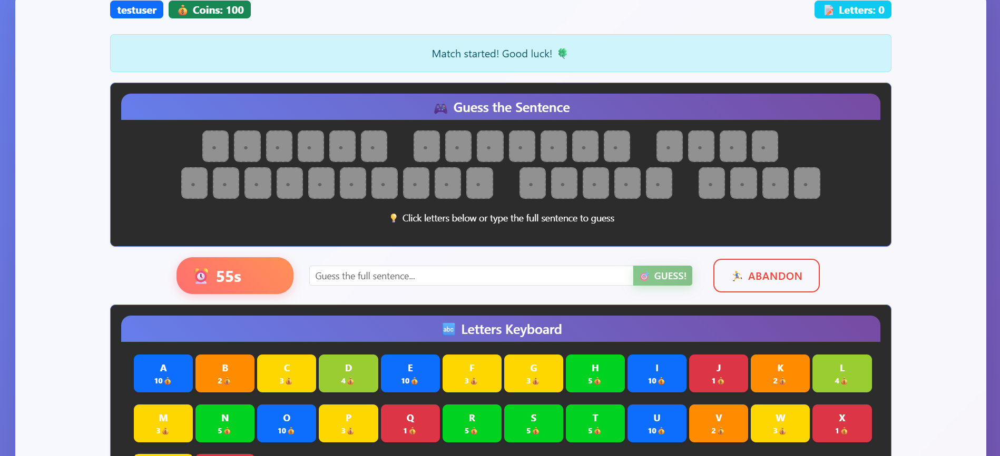
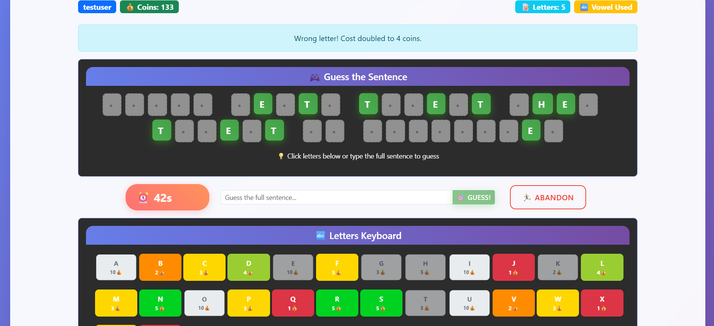
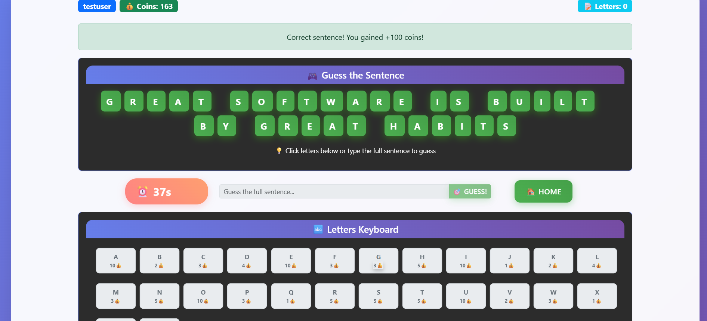
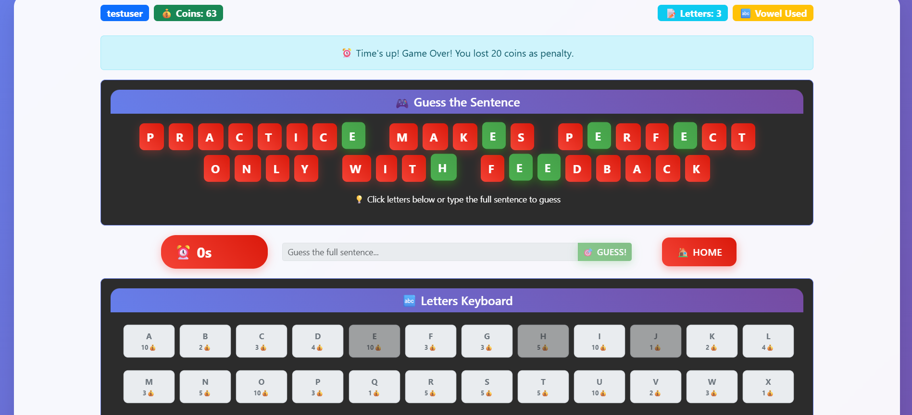
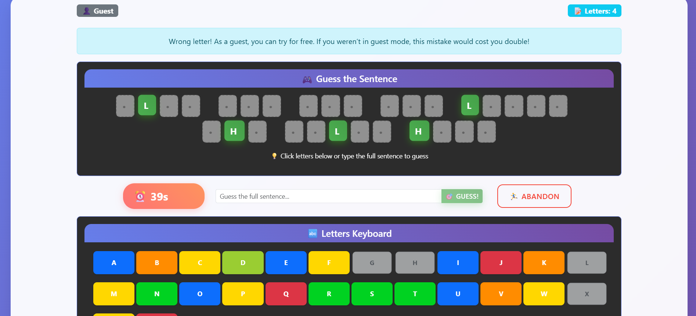

[](https://classroom.github.com/a/9bh6fYH1)
# Exam #3: "Guess a Sentence"
## Student: s336374 GIUNTI ALBERTO

## API Server

### Authentication Routes
- POST `/api/sessions`
  - request body: `{ username: string, password: string }`
  - response body: `{ id: number, username: string, coins: number }`
- GET `/api/sessions/current`
  - request parameters: none
  - response body: `{ id: number, username: string, coins: number }` or 401 error
- DELETE `/api/sessions/current`
  - request parameters: none
  - response body: empty (204 status)

### User Registration
- POST `/api/users`
  - request body: `{ username: string, password: string }`
  - response body: `{ id: number, username: string, coins: number }` (automatically logged in)

### Game Utility Routes
- GET `/api/butterfly`
  - request parameters: none
  - response body: `[{ letter: string, frequency: number, cost: number }]` (array of 10 random letters)
- GET `/api/letters/costs`
  - request parameters: none
  - response body: `{ A: number, B: number, ..., Z: number }` (cost mapping for all letters)
- GET `/api/me`
  - request parameters: none (requires authentication)
  - response body: `{ id: number, username: string, coins: number }`

### Authenticated User Match Routes
- POST `/api/matches`
  - request parameters: none (requires authentication)
  - response body: match object with game state
- GET `/api/matches/current`
  - request parameters: none (requires authentication)
  - response body: match object or null if no active match
- POST `/api/matches/:id/guess-letter`
  - request parameters: `id` (match ID)
  - request body: `{ letter: string }` (uppercase A-Z)
  - response body: `{ match: object, message: string }` (updated match state and result message)
- POST `/api/matches/:id/guess-sentence`
  - request parameters: `id` (match ID)
  - request body: `{ sentence: string }`
  - response body: `{ match: object, message: string }` (updated match state and result message)
- POST `/api/matches/:id/abandon`
  - request parameters: `id` (match ID)
  - response body: `{ match: object, message: string }` (abandoned match state)

### Guest Mode Match Routes
- POST `/api/guest/matches`
  - request parameters: none (no authentication required)
  - response body: match object with game state
- GET `/api/guest/matches/current/:id`
  - request parameters: `id` (match ID)
  - response body: match object or 404 error
- POST `/api/guest/matches/:id/guess-letter`
  - request parameters: `id` (match ID)
  - request body: `{ letter: string }` (uppercase A-Z)
  - response body: `{ match: object, message: string }` (updated match state and result message)
- POST `/api/guest/matches/:id/guess-sentence`
  - request parameters: `id` (match ID)
  - request body: `{ sentence: string }`
  - response body: `{ match: object, message: string }` (updated match state and result message)
- POST `/api/guest/matches/:id/abandon`
  - request parameters: `id` (match ID)
  - response body: `{ match: object, message: string }` (abandoned match state)

### Match Object Structure
All match endpoints return a match object with the following structure:
```json
{
  "id": number,
  "status": "playing" | "won" | "lost" | "abandoned",
  "endsAt": number,
  "revealedMask": string,
  "guessedLetters": string[],
  "usedVowel": boolean,
  "spaces": boolean[],
  "revealed": (string | null)[],
  "sentence": string | null
}
```

## Database Tables

- Table `users` -  stores registered user accounts.
  - `id` (INTEGER PRIMARY KEY): unique user identifier
  - `username` (TEXT UNIQUE): user login name (3-32 characters)
  - `salt` (TEXT): random salt for password hashing
  - `password_hash` (TEXT): hashed password using scrypt
  - `coins` (INTEGER): user's current coin balance (default 100)

- Table `sentences` - contains all available sentences for the guessing game
  - `id` (INTEGER PRIMARY KEY): unique sentence identifier
  - `text` (TEXT): the sentence to be guessed (uppercase format)
  - `is_guest` (INTEGER): flag indicating if sentence is for guest mode (0=authenticated, 1=guest) with CHECK constraint

- Table `matches` - contains game session data and progress tracking
  - `id` (INTEGER PRIMARY KEY): unique match identifier
  - `user_id` (INTEGER): reference to users table (NULL for guest matches)
  - `sentence_id` (INTEGER): reference to sentences table
  - `started_at` (INTEGER): Unix timestamp when match started
  - `ends_at` (INTEGER): Unix timestamp when match expires (60 seconds duration)
  - `status` (TEXT): current match state with CHECK constraint ("playing", "won", "lost", "abandoned")
  - `revealed_mask` (TEXT): binary string indicating which letters are revealed (1=revealed, 0=hidden)
  - `guessed_letters` (TEXT): concatenated string of all letters guessed so far
  - `used_vowel` (INTEGER): flag indicating if user has already used their vowel (0=no, 1=yes) with CHECK constraint

## React Client Application Routes

- Route `/`: homepage with welcome message and navigation options to start authenticated or guest games
- Route `/login`: user authentication page with login form for existing users
- Route `/register`: user registration page with signup form for new account creation
- Route `/play`: authenticated game page where logged-in users can play the sentence guessing game with coin system
- Route `/guest`: guest mode game page where users can play without authentication or coin costs


## Main React Components

- `Game` (in `Game.jsx`): main game orchestrator that manages game state, handles match lifecycle, and coordinates all game-related components. Adapts behavior based on guest mode (used in `/guest` route) or authenticated mode (used in `/play` route) with different coin systems and API endpoints
- `GameInterface` (in `GameInterface.jsx`): displays the complete game interface including grid, keyboard, timer, and game controls during active gameplay
- `Grid` (in `Grid.jsx`): renders the sentence display with revealed letters, placeholders for hidden letters, and visual feedback for game completion
- `Keyboard` (in `Keyboard.jsx`): interactive virtual keyboard showing letters with their costs, availability status, and handles letter selection
- `ReadyToPlay` (in `ReadyToPlay.jsx`): start screen component that displays game mode information and provides start game functionality
- `Timer` (in `Timer.jsx`): countdown timer component that tracks remaining game time and triggers timeout events
- `GuessSentence` (in `GuessSentence.jsx`): input component for full sentence guessing with form validation and submission handling

## Screenshots

The following screenshots demonstrate various game states and scenarios:

### New Game Screen


Game interface immediately after starting a new match. Shows the sentence grid with hidden letters (displayed as dots), active timer countdown, virtual keyboard ready for letter selection, and all game controls available. The game session has begun and players can start making letter guesses or sentence attempts.

### In-Game Screen  


Ongoing gameplay with progress made. Shows the sentence grid with some letters already revealed through player guesses, updated virtual keyboard with used letters marked, remaining time, and current game state. Demonstrates active gameplay where players have made several letter guesses and are working toward completing the sentence.

### Won Game Screen


Victory state displaying the completed sentence with all letters revealed in green, congratulatory message, final score with coins earned, and options to return home.

### Lost Game Screen


Game over state when the player fails to complete the sentence within the time limit. Shows the complete sentence with missed letters highlighted in red, penalty information, and navigation options.

### Guest Game Screen


Guest mode gameplay interface available to both visitors and authenticated users as a tutorial or practice mode. Identical to regular gameplay but without coin costs or penalties, allowing players to learn the game mechanics, practice strategies, or simply enjoy playing without any financial risk. Perfect for experimenting with different approaches or introducing new players to the game.

## Users Credentials
The following **demo accounts** are pre-registered in the database for testing the application. You can use these credentials on the login page:

- **Username:** **`testuser150`** – **Password:** **`testpwd`** – (Starts with 150 coins, to test gameplay with a plentiful coin balance.)
- **Username:** **`testuser0`** – **Password:** **`testpwd`** – (Starts with 0 coins, to test behavior when a player has no coins left. This user cannot buy any letters until they gain coins by winning a round.)
- **Username:** **`testuser45`** – **Password:** **`testpwd`** – (Starts with 45 coins, a mid-range coin balance for general testing.)
